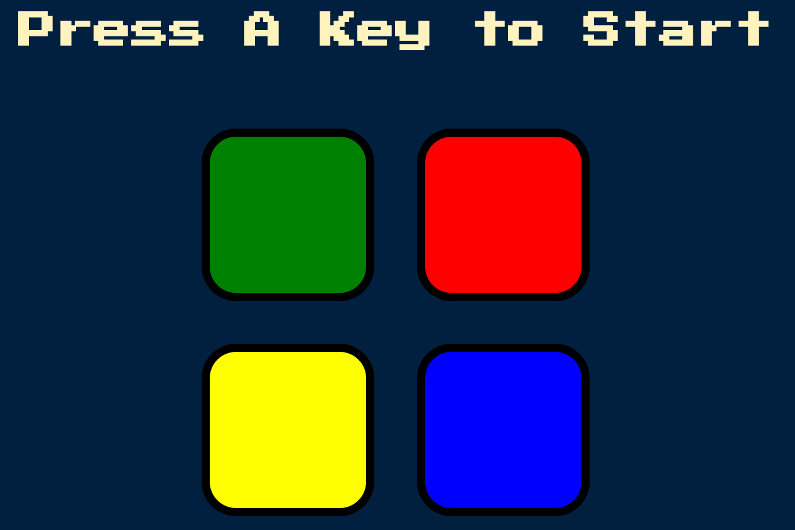
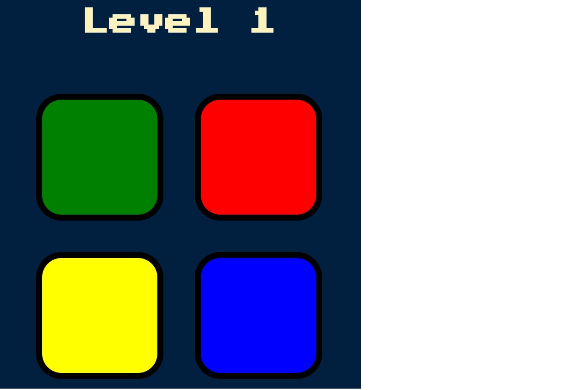
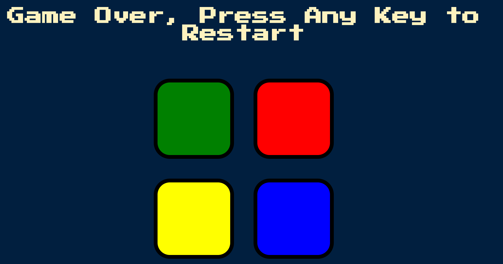

# Simon-Game
The famous Simon Game using HTML, CSS and jQuery.

# Idea
* To build and develop an advanced game which is easy to play using jQuery.
* Used event handlers, animations and audio files to develop the game.

# How to Play
* Press any key to start
* Check the button that is blinked (say red)
* The player has to press that button. As soon as the player presses a button, another button get blinked (say green)
* Now, the player needs to press on the red button and then on the green button. 
* In the next level, if the yellow button is blinked, the player needs to press red, followed by green, followed by yellow
* The difficulty of the game increases as the level of the game increases as the player needs to remember the sequence of the colors
* If the player fails to remeber the sequence, the game is over.

# Screeenshot

